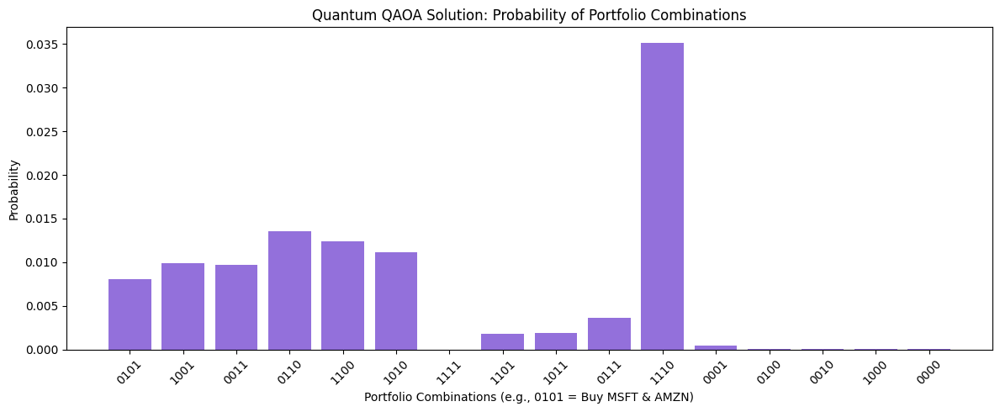

# 🪐 Quantum Portfolio Optimization


## 📌 Executive Summary
This project demonstrates how **Quantum Computing** can be applied to real-world financial problems. Specifically, it uses the **Quantum Approximate Optimization Algorithm (QAOA)** to solve a Portfolio Optimization problem, comparing the quantum results against a Classical Exact Eigensolver. 

**The Business Problem:** Given a basket of 4 tech stocks (AAPL, MSFT, GOOGL, AMZN), historical market data, and a specific risk/return appetite, what is the mathematically optimal combination of exactly 2 stocks to hold?

**The Quantum Solution:** We formulate this as a **Quadratic Unconstrained Binary Optimization (QUBO)** problem and solve it using IBM's Qiskit framework.

---

## 📊 Results & Visualization

Because QAOA is a probabilistic algorithm, running the quantum circuit yields a distribution of probabilities for all possible portfolio combinations. 


*(Note: Binary strings represent asset selection. e.g., `0110` means buy GOOGL and AMZN)*

### Key Findings:
1. **Classical Benchmark:** The classical exact solver identified the absolute optimal portfolio based on our risk/return parameters.
2. **Quantum Alignment:** The QAOA quantum simulation successfully identified high-probability states that align perfectly with the classical solution. 
3. **Constraint Penalties:** The visualization shows how the algorithm navigates "penalties" (picking too many or too few stocks), demonstrating the behavior of quantum heuristic optimization.

---

## 🛠️ Technology Stack
* **Language:** Python
* **Quantum Framework:** Qiskit, Qiskit-Finance, Qiskit-Optimization
* **Classical Math/Data:** NumPy, Pandas, Yahoo Finance (yfinance)
* **Visualization:** Matplotlib

---

## 🚀 How to Run the Project

**1. Clone the repository**
```bash
git clone https://github.com/rupajietishere/Quantum-Portfolio-Optimization.git
cd quantum-portfolio-optimization
```

**2. Install dependencies**
```bash
pip install -r requirements.txt
```

**3. Run the Jupyter Notebook**
```bash
jupyter notebook portfolio_qaoa.ipynb
```

---

## 🧠 The Math Behind the Code (Modern Portfolio Theory)
The problem utilizes Markowitz's Mean-Variance Portfolio Theory. We aim to minimize the objective function:

$$ \min_{x} \left( q \cdot x^T \Sigma x - (1-q) \cdot \mu^T x \right) $$

Where:
* $x \in \{0, 1\}^n$: Binary decision variables (Buy / Don't Buy)
* $\mu$: Expected returns of the assets
* $\Sigma$: Covariance matrix (Risk)
* $q$: Risk factor tolerance

We apply a penalty to enforce a hard budget constraint (exactly 2 assets must be chosen).

---

## 🤝 Connect with Me
[](https://www.linkedin.com/in/rupajiet-bhattacharjee-60932769)  
[](https://github.com/rupajietishere)